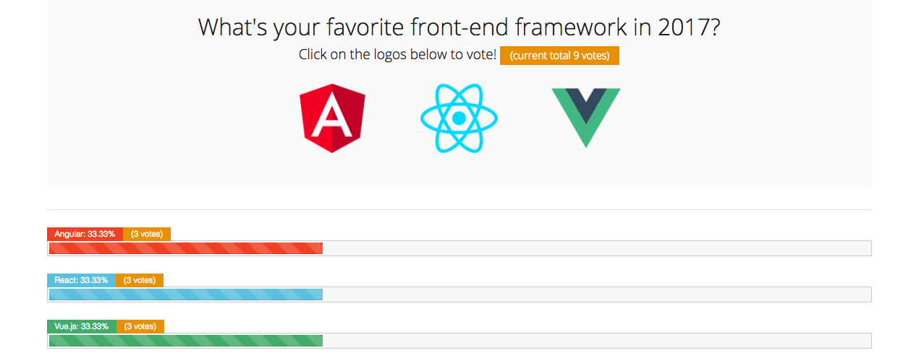

## react-redux voting-app

original from https://github.com/seeschweiler/redux-voting

- using bootswatch yeti css
- updating to react-redux connect, provider

## Quick start

```bash
$ yarn start
$ open http://localhost:3000
```

## Screenshot

